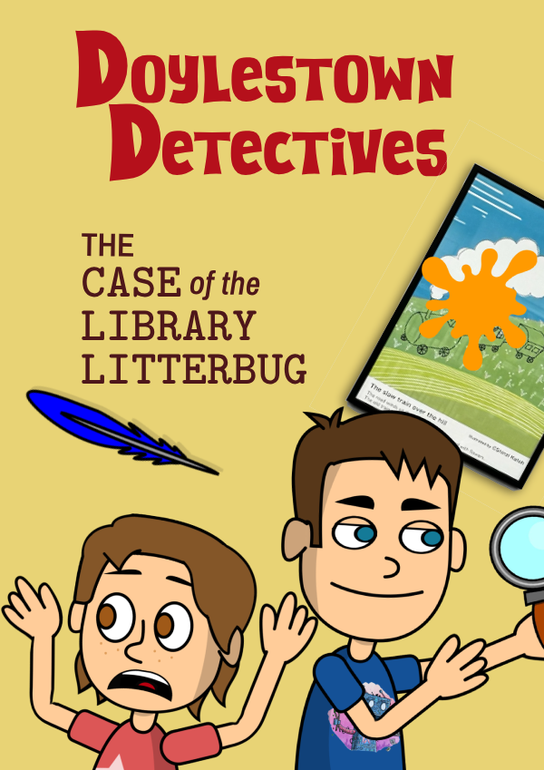
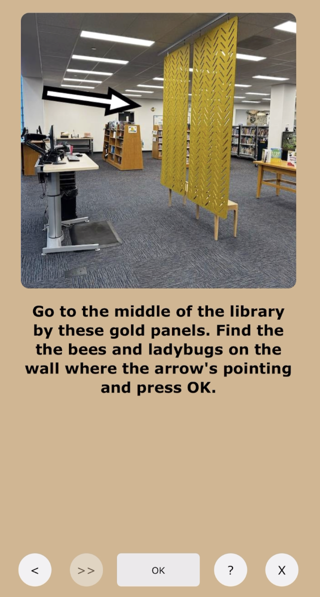
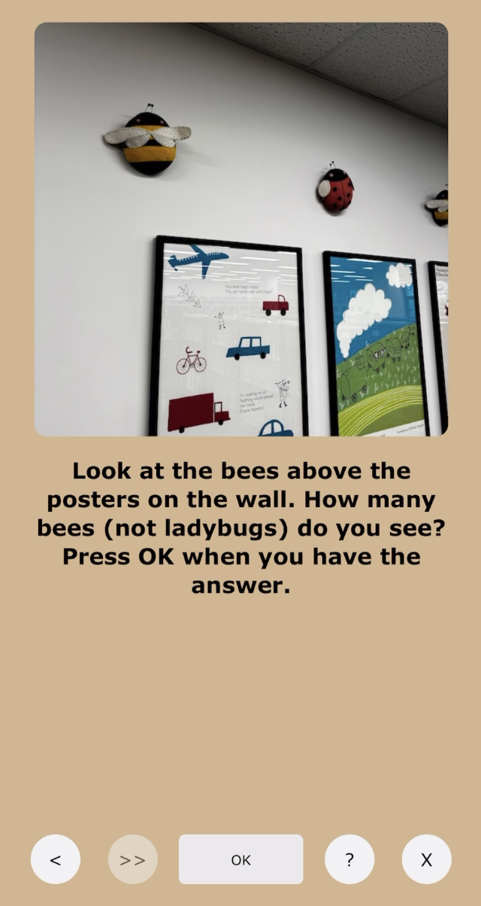
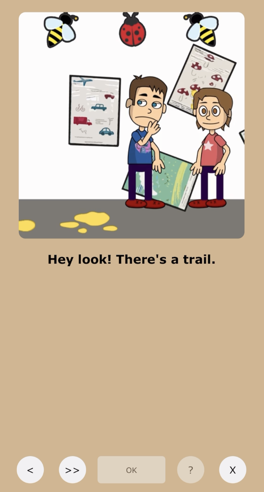

# Doylestown Detectives
An interactive, location-based mystery game set in the local library — where players solve clues by exploring the real world environment.

    
  

    <strong>Doylestown Detectives</strong> is a scavenger hunt style mystery game inspired by the "Duck Tales" game in the World Showcase at Disney World Epcot. Players follow the story starring local Doylestown kids (in cartoon form) exploring the building and answering real world clues. You must be physically present in the library to be able to answer the questions and progress to see the whole story!
  

    
  

    After you watch some of the story video, the hunt is on. The app tells you where to go in the library.
  

    
  

    Answer the question based on investigating the area in real life...
  

    

And the hilarious story continues! You'll then be shown the next area to investigate and repeat until you've solved the mystery.

# Technologies Used
- React
- TypeScript
- HTML/CSS
- Adobe Character Animator / After Effects / Audition / Photoshop

# How To Play
1. Visit the Doylestown Library.
2. Launch the game on a tablet or phone [https://doylestowndetectives.com](https://doylestowndetectives.com).
3. (Optional) Add the game to the home screen to remove the address bar. Use that button to launch app!
   - iOS - Tap the Share button at the bottom, then select Add to Home Screen.
   - Android - Tap the three dots in the top right and tap Add to Home Screen.
4. Select "The Library Litterbug!" mission.
5. Watch the cartoon video. If you want to skip the video or go back, use the navigation buttons in the bottom left.
6. Search the library to answer questions and solve the mystery!
